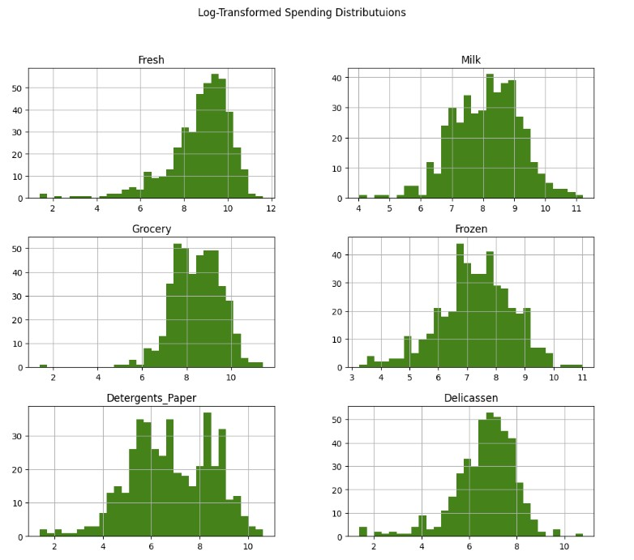
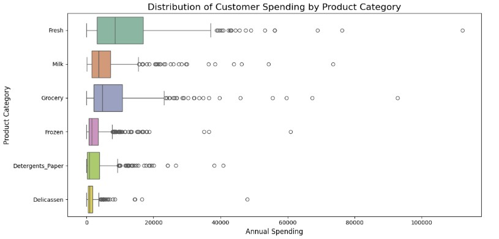
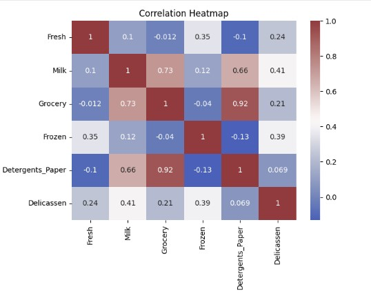
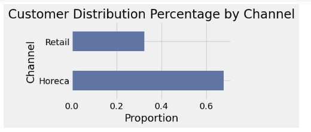
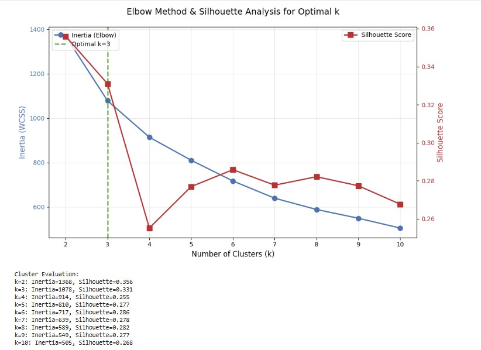

# Customer Clustering Analysis

## Overview and Analysis Objective
The objective of this analysis is to identify meaningful customer segments based on spending behavior 
using unsupervised clustering techniques. The dataset contains aggregated spending amounts across 
multiple product categories for wholesale customers. Customers are grouped according to their 
purchasing patterns without predefined labels, allowing natural behavioral segments to emerge. 
Categorical variables such as Channel and Region are retained for post-cluster interpretation 
to help contextualize the resulting segments.

## Data Description
The dataset used in this analysis is the Wholesale Customers Data Set from the UCI Machine Learning Repository.
Each observation represents a customer’s purchasing behavior summarized over a fixed observation period.
* It contains aggregated spending amounts for wholesale customers across six product categories: 
Fresh, Milk, Grocery, Frozen, Detergents_Paper, and Delicatessen. These spending variables are continuous and non-negative.
* The dataset also includes two categorical variables: Channel, 
indicating customer type (Horeca or Retail), and Region, indicating geographic location (Lisbon, Oporto, or Other).

## Exploratory Data Analysis(EDA)
The exploratory data analysis focuses on understanding customer spending behavior across product categories and 
assessing feature suitability for clustering.

### Spending Distributions
Initial histograms of the raw spending variables reveal highly right-skewed distributions, with a small subset of customers accounting for disproportionately large expenditures. These heavy-tailed patterns indicate substantial diversity in purchasing behavior and suggest that distance-based methods may be dominated by extreme values if left unaddressed.

After applying a log1p transformation, the distributions become more symmetric and centered, with reduced skewness and kurtosis. This transformation preserves relative spending differences while improving numerical stability and interpretability for clustering algorithms.

## Outliers and Variability

Boxplots of the spending variables further highlight the presence of extreme high-spending customers, particularly in the Fresh and Grocery categories. While these observations appear as statistical outliers, they likely represent meaningful customer segments rather than noise.

Accordingly, outliers are retained in the dataset to allow the clustering process to identify and separate high-value customers as distinct behavioral groups.

## Correlation Structure

Correlation analysis of the numeric spending features reveals strong positive relationships between certain product categories. 
* Grocery and Detergents_Paper spending show a very strong positive correlation, implying similar purchasing behavior.
* Milk spending is also strongly correlated with Grocery, indicating related buying patterns.
* In contrast, grocery shows weak correlation with Fresh and Frozen, suggesting more independent purchasing behavior across these categories.
  

The scatter plot reinforces the strong positive relationship between Grocery and Detergents_Paper observed in the correlation analysis.

## Categorical Variable Overview
Categorical variables are examined separately from numeric spending features to provide contextual information for post-cluster interpretation.

Horeca customers comprise approximately two-thirds of the dataset, with Retail customers making up the remaining third.

Customers are primarily concentrated in the “Other” region, with Lisbon and Oporto each representing smaller shares of the overall dataset.

➡️ Full analysis: [`1_EDA.ipynb`](1_EDA.ipynb)

## Data Preprocessing (for Clustering)

Clusting is performed using the behavioral variables during exploratory analysis. Categorical variables (Channel and Region) are excluded from clustering and will be retained for post-cluster interpretation.

### Feature Selection

The following six continuous spending variables are used as input features for the basis for segmentation:
* Fresh
* Milk
* Grocery
* Frozen
* Detergents_Paper
* Delicassen

### Tranformation (Log)

As described in EDA, a loglp transformation is applied to the spending features to improve cluster stability by preventing high-spending customers from disproportionately influencing distance calculations.

### Scaling

After transformation, features are standardized using StandardScaler.
Scaling ensures that all variables contribute equally to distance-based clustering algorithms such as K-Means and hierarchical clustering, preventing features with larger numeric ranges from dominating the analysis.

### Principal Components Anaysis (Dimensionality Reduction)

Principal Components Analysis (PCA) is applied to the scaled data to reduce dimensionality while preserving the majority of variance in customer spending behavior. PCA also helps improve clustering performance by reducing noise and collinearity among features.

**Analysis:**

The first 3 principal components capture 82.0% of the total variance in the data, exceeding the commonly used 80% threshold for dimensionality reduction. While adding a fourth component would increase cumulative variance to 92.1%, the marginal gain (10.1%) does not justify the added complexity. Therefore, n_components=3 was selected for clustering analysis, balancing information retention with model simplicity.

### Identifying the Number of Clusters (Elbow Method and Silhouette Analysis)
To determine the optimal number of clusters, both the Elbow Method and Silhouette Analysis are used.

* The elbow plot evaluates diminishing reductions in inertia as the number of clusters increases.

* The silhouette score measures how well each point fits within its assigned cluster compared to others, with higher values indicating better-defined clusters.
  
Elbow (Inertia) + Silhouette Charts

**Interpretation:**

* Silhouette analysis (red) peaks at k = 3 with an average score of 0.33, indicating acceptable separation for behavioral data. The elbow curve (blue) also shows diminishing returns beyond k = 3, suggesting no substantial improvement from additional clusters. 
* Both silhouette and inertia merge at k = 3, indicating the three-cluster solution provides a better balance between separation and interpretability.

## Hierarchical Clustering (Dendrogram – Supportive Analysis)
To help determine number of clusters, the hierarchical clustering is applied.

The dendrogram displays a clear separation at higher linkage distances, with a gap around a distance of 14. Splitting the dendrogram here at y=14 results in three main branches, which is consistent with the three-cluster solution assessed by elbow and silhouette methods.

**Therefore, k = 3 is selected as the optimal number of customer segments.**

➡️ Full analysis: [`2_Preprocessing`](2_Preprocessing.ipynb)

## Fit the final clustering

Based on elbow, silhouette, and hierarchical confirmation, k = 3 is selected as the final clustering solution.

## 5 Cluster Profiling

[View Preprocessing Notebook](2_Preprocessing.ipynb)

## Clustering
- Model selection rationale
- K-Means implementation
- Cluster evaluation

[View Clustering Notebook](3_Clustering.ipynb)

## Cluster Interpretation
- Spending profiles
- Channel & Region composition

--
several jpgs
2-3 clusters:https://github.com/EsserMishelle/customer-spending-segmentation/blob/main/assets/sil_2_3_clusters.jpg
4-5
6-7
8

[View Clustering Notebook](4_Clustering_Interpretation.ipynb)

## Results
Key insights and takeaways
